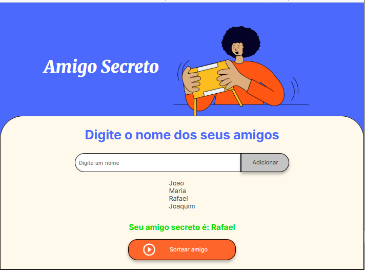

# Projeto Sorteador de Amigo Secreto


Este é um projeto desenvolvido como parte do primeiro desafio do programa **ONE (Oracle Next Education)** em parceria com a Alura. A aplicação consiste em um sorteador de amigo secreto, permitindo adicionar participantes e realizar o sorteio de forma simples e intuitiva.

## 🚀 Funcionalidades

O projeto foi criado para treinar as habilidades iniciais em desenvolvimento web e inclui as seguintes funcionalidades:

- **Adicionar Participantes**: Permite inserir nomes na lista de participantes do amigo secreto.
- **Remover Participantes**: Remove um participante da lista caso seja necessário.
- **Sortear**: Realiza o sorteio de forma aleatória, garantindo que cada pessoa tire outra e não a si mesma.
- **Exibir Resultados**: Mostra a lista de quem tirou quem.
- **Reiniciar**: Limpa a lista de participantes e os resultados para um novo sorteio.

## 🖼️ Telas da Aplicação

_Tela principal onde os participantes são adicionados e o sorteio é realizado._



## 🛠️ Tecnologias Utilizadas

As seguintes ferramentas e tecnologias foram usadas na construção do projeto:


## ⚙️ Como Executar o Projeto

Como é um projeto front-end simples, você pode executá-lo localmente seguindo os passos abaixo:

1.  **Clone o repositório:**

    ```bash
    git clone https://github.com/seu-usuario/challenge-amigo-secreto.git
    ```

2.  **Navegue até o diretório do projeto:**

    ```bash
    cd challenge-amigo-secreto
    ```

3.  **Abra o arquivo `index.html` no seu navegador de preferência.**

Pronto! A aplicação estará funcionando.

## 👨‍💻 Autor

<sub>
  <b>CLEITON DOS SANTOS PEREIRA</b>
</sub>
<br>
<a href="https://www.linkedin.com/in/cleiton-s-pereira/">
  
</a>

## 📄 Licença

Este projeto está sob a licença MIT. Veja o arquivo LICENSE para mais detalhes.
